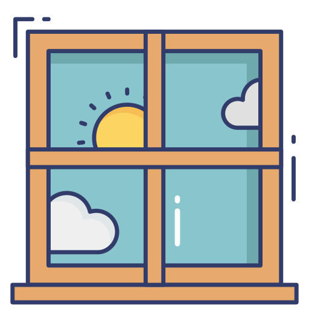

    

 

<h2 >
 「NOTAB」 複数のタブからの脱却
</h2>

 

# 概要

YouTubeの複数生配信を一つのウィンドウにて視聴できる Web アプリケーションです

 

# 🔨

現在開発段階であり多数のバグが見受けられます。  
気軽に[Issues](https://github.com/Ryuyxx/notab/issues)より報告をお願いします。

 

# 免責

- [MIT License](https://ja.wikipedia.org/wiki/MIT_License)
- 当コード及びサイトは複数同時視聴を推奨するものでは無く、[Youtube 利用規約](https://developers.google.com/youtube/terms/developer-policies)を遵守します。

 

# 構成

- [Next js](https://nextjs.org/)
- [Tailwind css](https://tailwindcss.com/)
- [Vercel](https://vercel.com/)
- [microCMS](https://microcms.io/)
